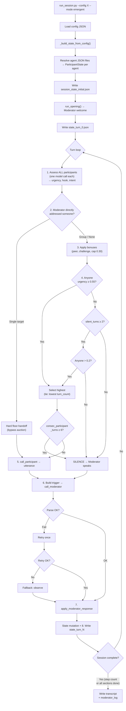

# Operational Flow: Authoritative Runtime Reference

**Status:** Verified against two live runs (`macho_meals_emergent_full_run_02`, `verify_handoff`) and a static call-graph trace. Every claim is tagged with its verification status.

**Verification status key:**
- **[observed]** — seen in a real run; evidence in session logs.
- **[static]** — confirmed in code; never exercised in a run.
- **[dormant]** — built but cannot currently fire (code path exists, conditions unreachable under current prompting/schema).

**Complements:** `ARCHITECTURE.md` (design intent, corrected for stale claims). `docs/operational_flow_verification.md` (evidence appendix for the status tags below).

---

## 1. Inputs

### Session config JSON

Every run consumes one session config file. Fields and what each controls:

| Field | What it controls | Required? |
|-------|------------------|-----------|
| `session_id` | Output directory name under `output/session_logs/` | Yes |
| `research_objective` | Sent to the moderator as research framing | Yes |
| `topic_domain` | Sent to the moderator | Yes |
| `participant_collective_identity` | Stored in `SessionMeta`; sent to the moderator; **not** injected into participant prompts | Yes |
| `moderator_knowledge_brief` | What the moderator is allowed to know; excludes hypotheses | Yes |
| `researcher_notes` | Sent to the moderator | No (default `""`) |
| `temperature` | All participant + engagement API calls; **not** moderator (moderator is hardcoded 1.0) | No (default `1.0`) |
| `moderator_model` | Model for all moderator API calls | No (default `"claude-sonnet-4-6"`) |
| `participant_response_max_tokens` | Overrides per-agent `max_tokens` ceiling | No (default: agent's own, typically 400) |
| `participation_mode` | `"orchestrated"` or `"emergent"`; overridable by `--mode` CLI flag | No (default `"orchestrated"`) |
| `inject_participant_intro` | When `true`, render each intro-eligible agent's `opening_intro.text` in their prompt | No (default `false`) |
| `run_label` | Recording-only label for organizing replicated runs (renamed from `generation_seed` 2026-06-29 — no functional effect; the Anthropic API has no seed parameter) | No (default `null`) |
| `participants` | List; each entry has `agent_payload_path` pointing to an agent JSON file | Yes |
| `discussion_guide` | Ordered list of guide sections | Yes |

### Agent JSON files (`fg_agents_v1` schema)

Each agent is a JSON file referenced by the config. Which fields reach the model and which are held out:

| Block | Rendered into participant prompt? | Purpose |
|-------|----------------------------------|---------|
| `persona.demographics` (name, age, gender, diet, location) | **Yes** — identity line, location, diet | [observed] |
| `persona.food_consumption` | **Yes** — eating-pattern bullets | [observed] |
| `persona.study_profile` / `persona.professional_profile` | **Yes** — via generic fallback ("Additional context about you") | [observed] |
| `simulation_config.notes` | **Yes** — "Additional context: {notes}" | [observed] |
| `opening_intro.text` | **Conditionally** — only when `inject_participant_intro=true` + `intro_eligible` | [observed] |
| `language` | Controls English vs Spanish template rendering | [observed] |
| `psychometric_scores` | **No** — top-level, never rendered; held out for analysis | [observed] |
| `study_context` | **No** — top-level, never rendered; dataset metadata | [observed] |
| `field_provenance` | **No** — metadata only | [static] |
| `simulation_config.model` | Controls which model is called for this participant | [observed] |
| `simulation_config.max_tokens` | Controls response-length ceiling (default 400) | [observed] |

### CLI flags (`run_session.py`)

| Flag | Effect |
|------|--------|
| `--config` | Path to session config JSON (required) |
| `--turns` | Number of loop iterations (default 3) |
| `--mode` | Overrides `participation_mode` from config |

---

## 2. Outputs

Every file written to `output/session_logs/{session_id}/`:

| File | Written when | Contents |
|------|-------------|----------|
| `session_state_initial.json` | Once, during `__init__` | Full state before any API call; includes `agent_payload` |
| `state_turn_0.json` | After opening turn | State after moderator welcome; includes `initial_session_plan` |
| `state_turn_{N}.json` | After every moderator turn | Full uncompressed snapshot; N = `total_turns`; includes `agent_payload`, `last_engagement_round` |
| `api_calls.jsonl` | Appended per API call | One JSON line per call; event types: `moderator_decision_attempt`, `moderator_decision_retry_attempt`, `moderator_decision_fallback`, `moderator_decision`, `participant_engagement_assessment`, `participant_response_generation`; includes model, tokens, stop reason |
| `transcript.json` | At session end (`finally` block) | Ordered utterance list; excludes observe/yield (no visible utterance) |
| `transcript.txt` | At session end | Human-readable `[TURN N] SPEAKER: content` |
| `moderator_log.json` | At session end | Full `ModeratorLogEntry` list including observe/yield turns, justifications, `validation_fallback` flags, `selection_mode` |

**Exit code:** A successful `run_session.py` run exits **0**. [observed]

---

## 3. The Order of Actions (One Full Turn Cycle)

**[observed]** — verified against turns 7–12 of the `verify_handoff` run.

1. **Assess all participants** — one `assess_engagement()` API call per participant (model from agent JSON; `max_tokens=250`; `temperature` from session config). Each participant reads the last 6 transcript entries and their own prior utterances, then returns `{wants_to_speak, urgency, hook, addressed_to, intent}` as JSON. On any failure: silent default (`urgency=0.0`, `wants_to_speak=false`). Results stored in `group_state.last_engagement_round`.

2. **Check for moderator direct-address** — if the previous moderator turn was `speak` with a `target` that resolves to exactly one participant, that participant is hard-handed the floor (bypass steps 3–4). If the target resolves to multiple participants, each receives a +0.15 urgency bonus and the auction runs normally. If `target` is `"group"` or absent, proceed to the auction unchanged.

3. **Apply urgency bonuses** — for each participant: peer-address bonus (+0.15 if the previous speaker addressed them); consensus-risk challenge bonus (+0.10 if `consensus_risk ≥ 0.65` and intent is `"challenge"`). Bonuses capped at 0.30; urgency clamped to 1.0.

4. **Select speaker** — filter to participants with `wants_to_speak=true`, `intent ≠ "stay_silent"`, `urgency ≥ 0.55`. Sort by `(-urgency, turn_count)` (highest urgency first; tie → fewest prior turns). Pick first. If nobody qualifies and `consecutive_silent_turns ≥ 2`: lower the bar to `urgency > 0.2`. If still nobody, or if `consecutive_participant_turns ≥ 6`: moderator must speak.

5. **Participant speaks** — `call_participant()` assembles the system prompt (§ prompt assembly), formats the recent transcript as context, and calls the participant's model. Response text captured.

6. **Moderator assesses** — a trigger event is built (speaker, content, turn number) and passed to `call_moderator()`. The moderator receives the full session state (serialized, last 3 log entries, `agent_payload` excluded), the trigger, the current phase modifier, and any active special-case injections. Returns a structured JSON decision (intervention mode, action, target, probe type, urgency assessments, emotional signals, contradictions, themes). If parse/validation fails: retry once with a correction message; if retry fails: substitute a fallback (observe, no utterance, `validation_fallback=true`).

7. **State updated** — `apply_moderator_response()` runs a single mutation pass: increment `total_turns`; update speaker's `turn_count`, `last_response_quality`, `engagement_signal`, `topics_covered`; recompute `participation_balance`, `silent_participants`, `dominant_voices`; advance section if `section_transition`; update `consensus_risk`, `emotional_signals`, `unresolved_tensions`; record the participant utterance and moderator utterance (if non-silent) in the transcript; append `ModeratorLogEntry`.

8. **State snapshot written** — `state_turn_{N}.json` saved to disk.

### How turns chain

The loop repeats from step 1. Each iteration produces 4–N engagement calls (one per participant), 0–1 participant calls, and 1 moderator call.

### Loop termination

Two mechanisms exist:
- **Fixed step count** (`run_session.py`): `--turns N` runs exactly N iterations regardless of guide state. [observed]
- **Guide completion** (validation harness): loop continues until the moderator has fired `section_transition` on every guide section, including the closing section. [observed — `macho_meals_emergent_full_run_02` completed all 6 sections at turn 45]

---

## 4. Decision Branches

Every branch point in the loop, with the conditions that send the flow each way:

### Speaker selection

```
Has the moderator directly addressed a single participant?
├─ YES (target resolves to 1 PID) → hard floor-handoff [observed]
│   selection_mode = "moderator_direct_address"
│   (skip urgency auction entirely)
│
├─ MULTIPLE (target resolves to 2+ PIDs) → bonus each +0.15, run auction [dormant]
│   (prompt constrains target to single; parser supports comma-separated)
│
└─ NO (target = "group" / None) → urgency auction [observed]
    │
    ├─ Any participant with urgency ≥ 0.55? → select highest [observed]
    │   selection_mode = "voluntary"
    │
    ├─ Nobody ≥ 0.55 AND consecutive_silent_turns ≥ 2?
    │   ├─ Highest urgency > 0.2? → select that participant [static]
    │   │   selection_mode = "low_threshold"
    │   └─ Nobody > 0.2 → moderator must speak [observed]
    │       selection_mode = "silence_or_forced"
    │
    └─ Nobody ≥ 0.55 AND consecutive_silent_turns < 2?
        → moderator must speak [observed]
        selection_mode = "silence_or_forced"
```

**Consecutive-turn gate:** If a participant is selected but `consecutive_participant_turns ≥ 6`, selection is cancelled and the moderator is forced to speak. [static]

### Moderator intervention mode

```
intervention_mode (model-decided):
├─ "speak" → produce an utterance; action determines what kind [observed]
│   Actions: ask_initial_to_group, direct_probe, redirect_to_group,
│            invite_dissent, synthesize_and_challenge, reactivate_silent,
│            reflect_contradiction, introduce_stimulus, section_transition,
│            invite_to_speak, stay_silent
│
├─ "observe" → no utterance; increment consecutive_silent_turns [observed]
│
└─ "yield" → no utterance; increment consecutive_silent_turns [observed]
```

### Moderator response parse/validate

```
First parse attempt:
├─ Success → apply to state [observed]
└─ Failure → append correction, retry once
    ├─ Retry succeeds → apply to state [observed]
    └─ Retry fails → substitute fallback (observe, no utterance) [observed]
```

### Section advancement

```
Moderator fires section_transition (model-decided):
├─ Current section marked completed
├─ current_section_index advanced
├─ section_phase updated from new section
├─ section_turn_counts reset
└─ If last section completed → loop exit condition met (harness only)
```

The "≥3 substantive responses before transition" rule is a **prompt instruction only** — not code-enforced. The moderator model chooses when to transition. [observed — all transitions occurred after ≥3 turns, but this was the model's judgment]

---

## 5. How Decisions Are Made

For each decision, who decides and how:

| Decision | Who decides | How |
|----------|-------------|-----|
| Whether a participant wants to speak | **Model** (participant's own model) | `assess_engagement()` prompt asks "do you feel genuinely compelled to speak right now?" — returns `wants_to_speak`, `urgency`, `hook` |
| Which participant speaks | **Code** (deterministic sort) on **model-produced** urgency | Sort by `(-urgency, turn_count)`; first above threshold wins |
| Whether the moderator speaks | **Model** | `intervention_mode` field in structured response |
| What the moderator says | **Model** | `utterance` field |
| Which action the moderator takes | **Model** | `action` field (11 typed actions) |
| Whether/how to probe | **Model** | `action=direct_probe` + `probe_type` + `follow_up_intensity` |
| When to advance section | **Model** | Moderator fires `section_transition` |
| When a participant is directly addressed | **Model** (moderator chooses) → **Code** (hard handoff) | Moderator sets `target` to a participant; code resolves and overrides selection |
| Consensus risk estimate | **Model** (writes float) → **Code** (triggers injection at ≥0.65) | `consensus_risk_assessment` in response → threshold check in renderer |
| Silent/dominant participant flags | **Code** | <15% of total turns = silent; >50% of section turns = dominant |

---

## 6. Model-Decided vs Hard-Coded (Consolidated Table)

| Decision point | Determined by | Value / Rule | Verification status |
|----------------|---------------|-------------|---------------------|
| **Who speaks (emergent)** | Code sorting on model urgency | Sort `(-urgency, turn_count)` | [observed] |
| **Who speaks (orchestrated)** | Code round-robin | `(turn_count, pid)` ascending | [observed] |
| **Moderator intervention mode** | Model | `observe` / `yield` / `speak` | [observed] |
| **Moderator utterance** | Model | Free text | [observed] |
| **Moderator action** | Model | 11 typed actions | [observed] |
| **Probe depth** | Model | `probe_type` + `follow_up_intensity` | [observed] |
| **Section advancement** | Model | `section_transition` action | [observed] |
| **Session end (CLI)** | Code | `--turns` count | [observed] |
| **Session end (harness)** | Model | All sections completed | [observed] |
| **Direct-address handoff** | Code override on model target | Single resolved target → bypass auction | [observed] |
| **Multi-target bonus** | Code on model target | Comma-separated → +0.15 each | [dormant] |
| **Participant response ceiling** | Code | `max_tokens` (400 default) | [observed] |
| **Participant response length** | Model | Within ceiling; no sentence-count instruction | [observed] |
| **Engagement assessment ceiling** | Code | `max_tokens=250` | [observed] |
| **Moderator response ceiling** | Code | `max_tokens=1500` | [observed] |
| **Moderator temperature** | Code | Hardcoded 1.0 | [observed] |
| **Participant temperature** | Config | `session_meta.temperature` | [observed] |
| **Moderator model** | Config | `session_meta.moderator_model` (default `claude-sonnet-4-6`) | [observed] |
| **Participant model** | Agent JSON | `simulation_config.model` (default `claude-haiku-4-5-20251001`) | [observed] |
| **Urgency threshold** | Code | 0.55 (`config.py:3`) | [observed] |
| **Lowered-bar threshold** | Code | >0.2 after 2 consecutive silent turns | [static] |
| **Peer address bonus** | Code | +0.15 (`config.py:4`) | [static] |
| **Moderator invite bonus** | Code | +0.15 (`config.py:5`) | [observed] |
| **Consensus challenge bonus** | Code | +0.10 (`config.py:6`) | [static] |
| **Bonus cap** | Code | 0.30 (`orchestrator.py:505`) | [static] |
| **Max consecutive participant turns** | Code | 6 → moderator forced (`config.py:7`) | [static] |
| **Tie-breaking** | Code | Lower `turn_count` wins | [static] |
| **Silent-participant flag** | Code | <15% of total turns | [observed] |
| **Dominant-voice flag** | Code | >50% of section turns | [observed] |
| **Section depth ≥3** | Model (prompt instruction) | Not code-enforced | [observed] |
| **Consensus risk injection** | Model writes float; code enforces threshold | ≥0.65 triggers injection | [static] |
| **Retry then fallback** | Code | 1 retry; then fallback (observe, no utterance) | [observed] |
| **Transcript window** | Code | Last 6 entries shown to participants | [static] |
| **Moderator log window** | Code | Last 3 entries in moderator-facing state | [static] |
| **State compression** | Code | Entries before turn 40 compressed | [static] |

---

## 7. What the Model Is Free to Decide vs Constrained On

### The model decides (judgment-dependent)

The moderator model has sole discretion over: **whether** to intervene or stay silent; **what** to say; **which** action to take (probe, redirect, synthesize, challenge, transition, invite); **whom** to address; **when** to advance sections; and **how deeply** to probe. These are the moderator's research-quality judgments — the system provides structure but does not constrain frequency, depth, or topic.

Each participant model decides: **whether** it wants to speak and **how urgently** (via `assess_engagement`); **what** to say in its turn (via `call_participant`); and **how much** to say within the token ceiling. The behaviour instructions shape register (natural, not polished; deflection allowed when addressed directly) but do not prescribe content or length.

### The code constrains (rule-governed)

**Who actually speaks** is determined by a deterministic sort on model-produced urgency scores — the model influences the ranking via urgency but cannot directly choose the speaker (except via single-target direct address, which produces a hard handoff). **Thresholds** (0.55, 0.2, 0.65) are hardcoded and not model-tunable. **Bonuses** (+0.15/+0.10, cap 0.30) are fixed arithmetic. **Turn limits** (6 consecutive participant turns → forced moderator) are hardcoded gates. **Token ceilings** (400 participant, 250 engagement, 1500 moderator) are hard limits. **Temperature** for participants is configurable; for the moderator it is hardcoded at 1.0. **Retry logic** (one retry, then fallback) is deterministic. **Silent/dominant detection** uses fixed thresholds (<15%, >50%). **Output artifacts** (which files, when written) are fixed by code.

### The researcher configures (per-session)

Temperature, participation mode, moderator model, participant agent files, discussion guide, `inject_participant_intro`, `participant_response_max_tokens`, `run_label`. These are set once at session start and do not change during a run.

---

## 8. Visual Flowchart



---

## 9. Verification Status Key

Every claim in this document carries one of:

| Tag | Meaning | Evidence standard |
|-----|---------|-------------------|
| **[observed]** | Seen in any real run to date | The mechanism executed in at least one session run. Evidence sources include `macho_meals_emergent_full_run_02` (45 turns), `verification_emergent_25` (25 turns), `verify_handoff` (12 turns), and earlier orchestrated-mode smoke tests (`twin2k500_smoke_001/002`). Cited in `docs/operational_flow_verification.md`. |
| **[static]** | Confirmed in code; never triggered in any run | Call-graph trace or grep confirms the code path exists and the constants match. The path was not exercised because the triggering conditions did not arise naturally. |
| **[dormant]** | Built but cannot currently fire | Code path exists and parser handles it, but the moderator prompt constrains the input so the path is unreachable. Specifically: multi-target direct address (prompt says "one person or 'group'"). |

**Evidence appendix:** `docs/operational_flow_verification.md` contains the per-claim evidence tables from the static trace and live runs, including hash-verified instrumentation reversals.

---

## Appendix: Worked Example — `macho_meals_emergent_full_run_02`

45 turns. 5 Macho Meals FG1 participants. Emergent mode. Model-driven termination.

| Section | Label | Transition turn | Participant turns |
|---------|-------|-----------------|-------------------|
| 0 | Introduction | 7 | 7 |
| 1 | Everyday food decision-making | 16 | 9 |
| 2 | Gender and food choice | 27 | 11 |
| 3 | Imagining a plant-based shift | 34 | 7 |
| 4 | Making plant-based foods more appealing | 41 | 7 |
| 5 | Closing remarks | 45 | 4 |

Final participation: David 9, Ibrahim 9, Amir 8, Isaiah 8, Will 8. No dominant voices. 1 validation fallback (turn 0, opening truncation). Session ended when moderator transitioned the closing section.

**Conditions note:** This run used older agents where `simulation_config.notes` contained psychometric score values (now removed — scores held out in `psychometric_scores` block). The moderator model was patched to `claude-sonnet-4-6` at runtime by the validation script; current code defaults to `claude-sonnet-4-6` via `session_meta.moderator_model`.
